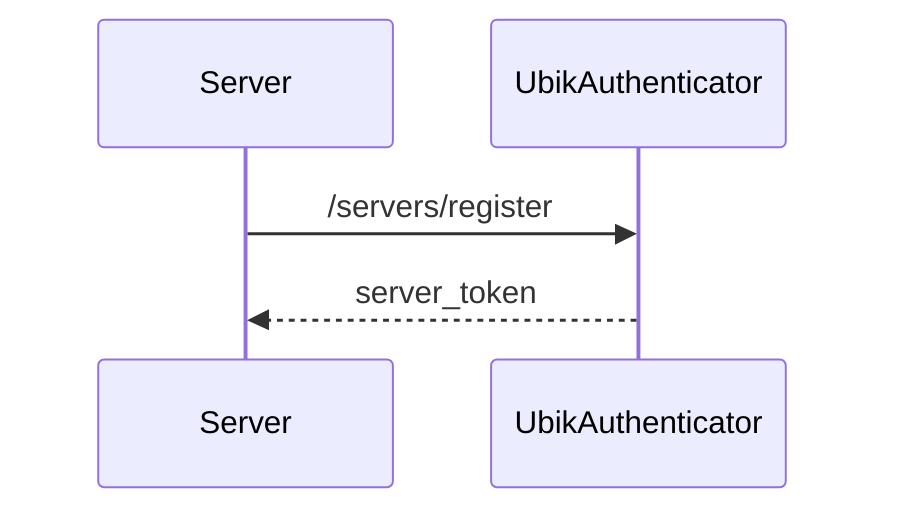
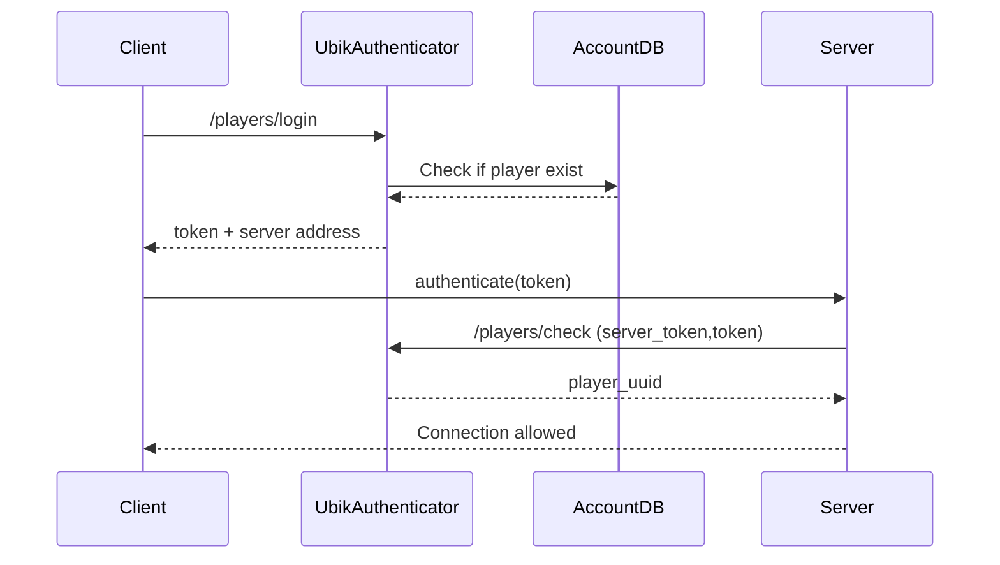


# Ubik Authenticator (WIP!)

This API will serve as an authenticator in your future large scale multi-user or multiplayer project. It's scalable and micro-service oriented.

### Why C# ?
It's probably easier to maintain a stack of only one language ! That said, this authenticator must just be deployed, and the language used isn't really that important.

## What does it need ?

To use UbikAuthenticator, you will need:
* [1, ...] instances of this Authenticator
* If multiple instances exist, use [Redis](https://redis.io/). If not, a SQLite database auto-generated will be enough.
* Game Servers. Each must handle data storage.

# How to use

This authenticator takes the form of an API and has two main routes: `/servers` and `/players`.

In a first time, UbikAuthenticator will receive all registrations from your servers. Indeed, it' will be the job of UbikAuth to tell to clients where to connect. Moreover, all servers will have to know the `SECRET_KEY` of UbikAuthenticator: if not any could pretend their machine is an official host !
Then, all your servers will have to call:
```json
{
  "method": "POST",
  "URI": "{{host}}/servers/register/{{SECRET_KEY}}",
  "body": {
    "serverName": "_server_unique_identifier",
    "serverUrl": "123.123.123.123:1234"
  },
  "returns": "server token"
}
```


## How does it work ?
This authenticator is an intermediate and distributed actor that will do:
* _(Game)_ Servers Registering,
* Player authentication and redirection.

**Initial Workflow: servers registering**


**Runtime Workflow: players authentication**



