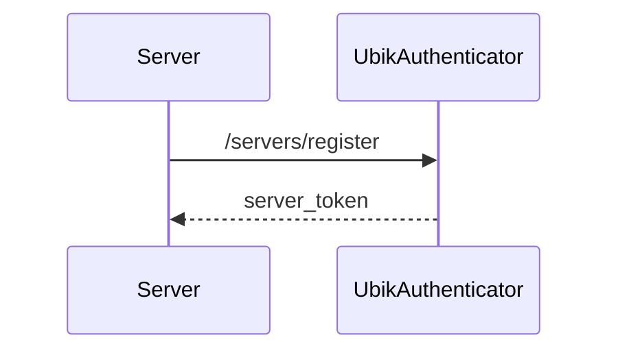
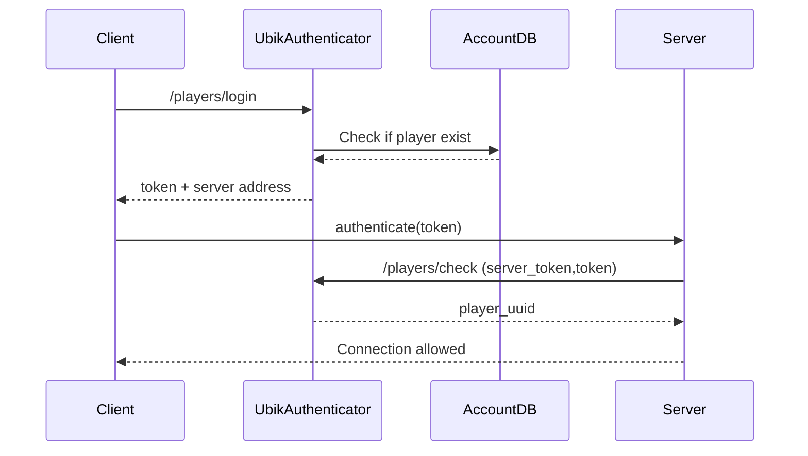


# Ubik Authenticator (WIP!)

This API will serve as an authenticator in your future large scale multi-user or multiplayer project. It's scalable and micro-service oriented.

### Why C# ?
It's probably easier to maintain a stack of only one language ! That said, this authenticator must just be deployed, and the language used isn't really that important.

## What does it need ?

To use UbikAuthenticator, you will need:
* [1, ...] instances of this Authenticator
* If multiple instances exist, use [Redis](https://redis.io/). If not, a SQLite database auto-generated will be enough.
* Game Servers. Each must handle data storage.

### Installation
UbikAuthenticator will **require** `dotnet 6.0` and the following packages:
```bash
# ASP.Net
dotnet add package Swashbuckle.AspNetCore
# SQLite
dotnet add package System.Data.SQLite.Core
# Redis
dotnet add package StackExchange.Redis
```
### Configuration
The configuration is quite easy. By providing C# environement variables, you can parametrize this. Everything can be edited in the classic `Properties/lauchProperties.json` file. Here's what you'll need to know:
| Parameter name | Effect | Expected values |
|--|--|--|
| `ASPNETCORE_ENVIRONMENT`| ASP variable. Use "Production". | `{"Development", "Production"}` |
| `SECRET_KEY`| The common secret all game-servers will share. They will need it to register. | __ |
| `SALT`| The salt used in password hashes. | __ |
| `IAUTH`| The mode of account database system to use. | `{"redis", "sqlite", "fake"}` |
| `IAUTH.sqlite.path`|**SQLITE:** the path to the storage file. | _A local file path,_ `/var/ubikauth/storage.db` _for example_ |
| `UAITH.redis.endpoints`| **REDIS:** A list of Redis endpoints. Separated by semi-colons. | _A string with the form_ `redis-endpoint-1:1234;redis-endpoint-2:1234`  |
| `UAITH.redis.password`| **REDIS:** The password to use in the authentication process | __ |
| `UAITH.redis.user`| **REDIS:** The username to use in the authentication process | __ |

**Additional notes:**
- The `fake` mode will store account data in the RAM and is transcient. To use for testing purposes only.
- If you have only on Redis endpoint, don't put any `;` in the list.

Don't forget to configure the data structure of your user's accounts. It's in [structure.json](/Properties/structures.json)

# How to use

This authenticator takes the form of an API and has two main routes: `/servers` and `/players`.

In a first time, UbikAuthenticator will receive all registrations from your servers. Indeed, it' will be the job of UbikAuth to tell to clients where to connect. Moreover, all servers will have to know the `SECRET_KEY` of UbikAuthenticator: if not any could pretend their machine is an official host !
Then, all your servers will have to call:
```json
{
  "method": "POST",
  "URI": "{{host}}/servers/register/{{SECRET_KEY}}",
  "body": {
    "serverName": "_server_unique_identifier",
    "serverUrl": "123.123.123.123:1234"
  },
  "returns": "server token"
}
```


## How does it work ?
This authenticator is an intermediate and distributed actor that will do:
* _(Game)_ Servers Registering,
* Player authentication and redirection.

**Initial Workflow: servers registering**


**Runtime Workflow: players authentication**



